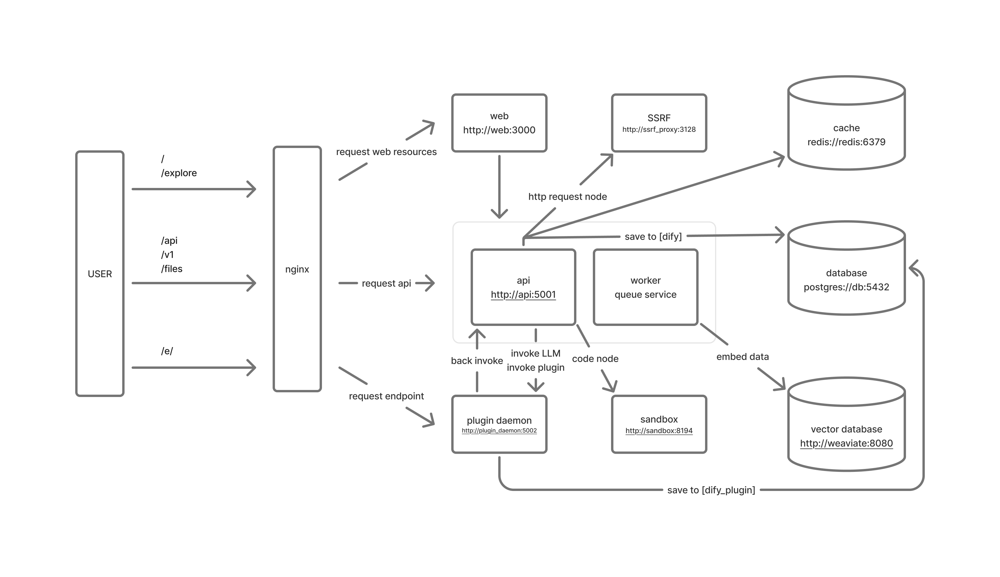

# Dify Helm Chart for Azure Kubernetes Service (AKS)

English | [中文](README.md)

This is a Helm Chart for deploying [Dify](https://github.com/langgenius/dify) on Azure Kubernetes Service (AKS). Dify is an open-source LLM application development platform, and this Helm Chart aims to simplify its deployment and management in Kubernetes environments.

## Features

- 🚀 One-click deployment of complete Dify platform to AKS
- 🔒 Built-in security configuration and secret management
- 🔄 CI/CD automation deployment support
- 📦 Includes all necessary dependencies (Redis, PostgreSQL, MinIO, etc.)
- 🔍 Multiple vector database options (Weaviate, Qdrant)

## System Architecture

This Helm Chart deploys the Dify platform with the following core components:

- **Frontend**: Dify's web interface
- **API Server**: Backend API service
- **Worker**: Asynchronous task processing service
- **PostgreSQL**: Main database (v12.1.6)
- **Redis**: Cache and message queue (v18.1.2)
- **MinIO**: Object storage service (v12.8.7)
- **Vector Database**: Vector database (supports Weaviate v16.3.0 or Qdrant v0.7.0)

### Architecture Diagram



*Architecture diagram sourced from Dify official Docker Compose deployment*

## Quick Start

### Prerequisites

- Azure Kubernetes Service (AKS) cluster
- Azure DevOps account (for CI/CD)
- Helm 3.x
- kubectl configuration

### Installation Steps

1. Create a custom values file:

```yaml
global:
  # Host configuration
  # Supports two configuration methods:
  # 1. IP address: For internal network access, e.g., "10.104.179.207"
  # 2. Domain name: For public network access, e.g., "dify.your-domain.com"
  # Note: When using domain names, ensure DNS resolution is correct and configure TLS certificates
  host: "10.104.179.207"  # Use frontend LoadBalancer IP as hostname
  
  # Port configuration
  # Usually no need to set, use default port
  # If custom port is needed, ensure it matches LoadBalancer configuration
  port: ""  # No need to set port
  
  # TLS configuration
  # - false: For internal network access or HTTP access
  # - true: For public network access, requires TLS certificate configuration
  enableTLS: false  # Internal network access doesn't need TLS
  
  image:
    tag: "1.4.1"  # Currently supported Dify version
  
  edition: "SELF_HOSTED"
  storageType: "s3"  # Use S3 storage

  # Additional environment variables configuration
  extraBackendEnvs:
  - name: SECRET_KEY
    valueFrom:
      secretKeyRef:
        name: dify-secrets
        key: SECRET_KEY
  - name: VECTOR_STORE
    value: "weaviate"  # or "qdrant"

# Component configuration
postgresql:
  enabled: true
  # PostgreSQL configuration...

redis:
  enabled: true
  # Redis configuration...

minio:
  enabled: true
  # MinIO configuration...

weaviate:
  enabled: true
  # Weaviate configuration...

qdrant:
  enabled: false
  # Qdrant configuration...
```

2. Push Helm Chart to Azure DevOps repository and execute Pipeline:

```bash
# Push Helm Chart to Azure DevOps repository
git add .
git commit -m "feat: update Dify Helm Chart configuration"
git push origin main

# Pipeline will automatically execute the following steps:
# 1. Create Kubernetes namespace
# 2. Generate and create necessary secrets
# 3. Update Helm dependencies
# 4. Deploy Dify application
# 5. Verify deployment status
# 6. Wait for services to be ready
```

After Pipeline execution completes, you will see output similar to:
```
================================================
Dify deployment completed!
Frontend access address: http://10.104.179.207
================================================
```

## Version Information

- Chart version: 0.1.0
- Dify application version: 1.4.1
- Dependency versions:
  - Redis: 18.1.2
  - PostgreSQL: 12.1.6
  - MinIO: 12.8.7
  - Weaviate: 16.3.0
  - Qdrant: 0.7.0

## CI/CD Configuration

This project includes Azure DevOps Pipeline configuration (`azure-pipeline-helm.yaml`) that supports automated deployment. Main features include:

- Automatic namespace creation
- Secret generation and management
- Helm dependency updates
- Application deployment
- Deployment status verification
- Service health checks

### Pipeline Variable Configuration

Configure the following variables in Azure DevOps:

```yaml
azureSubscriptionEndpoint: 'your-azure-subscription'
azureResourceGroup: 'your-resource-group'
kubernetesCluster: 'your-aks-cluster'
namespace: 'dify'
helmReleaseName: 'dify'
```

## Production Environment Configuration Recommendations

### 1. Security Configuration

- Use Kubernetes Secrets to manage sensitive information
- Configure appropriate resource limits and requests
- Enable network policies
- Regularly update keys and certificates

### 2. Storage Configuration

**Strongly recommend using external secure storage services**:

- **Database**: Use Azure Database for PostgreSQL or Azure Database for MySQL
  - Provides automatic backup and recovery
  - Built-in security and compliance
  - Auto-scaling and high availability
  - Managed maintenance and updates

- **Object Storage**: Use Azure Blob Storage or Azure Files
  - Provides data redundancy and disaster recovery
  - Built-in encryption and access control
  - Auto-scaling storage capacity
  - Better cost efficiency

- **Cache**: Use Azure Cache for Redis
  - Provides high-performance caching service
  - Built-in security and monitoring
  - Auto-scaling and failover

Benefits of using external storage:
1. **Data Security**: Professional data protection and backup strategies
2. **High Availability**: 99.9%+ service availability guarantee
3. **Auto-scaling**: Automatically adjust resources based on demand
4. **Cost Optimization**: Pay-as-you-use, avoid resource waste
5. **Simplified Operations**: Reduce operational burden, focus on application development

Configuration example:
```yaml
# Disable built-in database, use external PostgreSQL
postgresql:
  enabled: false

# Disable built-in Redis, use external Redis
redis:
  enabled: false

# Disable built-in MinIO, use external storage
minio:
  enabled: false

# Configure external storage connection information
global:
  extraBackendEnvs:
  - name: DB_HOST
    value: "your-postgresql-server.postgres.database.azure.com"
  - name: DB_PORT
    value: "5432"
  - name: DB_DATABASE
    value: "dify"
  - name: DB_USERNAME
    value: "dify_user"
  - name: DB_PASSWORD
    valueFrom:
      secretKeyRef:
        name: dify-secrets
        key: DB_PASSWORD
  - name: REDIS_HOST
    value: "your-redis-server.redis.cache.windows.net"
  - name: REDIS_PORT
    value: "6380"
  - name: REDIS_PASSWORD
    valueFrom:
      secretKeyRef:
        name: dify-secrets
        key: REDIS_PASSWORD
  - name: S3_ENDPOINT
    value: "https://your-storage-account.blob.core.windows.net"
  - name: S3_BUCKET_NAME
    value: "dify-storage"
  - name: S3_ACCESS_KEY
    valueFrom:
      secretKeyRef:
        name: dify-secrets
        key: S3_ACCESS_KEY
  - name: S3_SECRET_KEY
    valueFrom:
      secretKeyRef:
        name: dify-secrets
        key: S3_SECRET_KEY
```

### 3. High Availability Configuration

- Configure multiple replicas
- Use Pod anti-affinity
- Configure appropriate resource limits
- Use persistent storage

### 4. Monitoring and Logging

- Configure appropriate log levels
- Set up resource usage alerts
- Monitor service health status
- Regularly check system logs

## Maintenance and Upgrade

### Version Upgrade

1. Update image version in `values.yaml`
2. Execute Helm upgrade
3. Run database migration

```bash
helm upgrade dify dify-helm/dify -f values.yaml
kubectl exec -it $(kubectl get pod -l app.kubernetes.io/component=api -o jsonpath='{.items[0].metadata.name}') \
  -n dify -- flask db upgrade
```

### Backup and Recovery

- Regularly backup PostgreSQL database
- Backup MinIO storage data
- Save Helm values configuration

## Troubleshooting

Common issues and solutions:

1. Pod startup failure
   - Check resource limits
   - Verify environment variable configuration
   - View Pod logs

2. Database connection issues
   - Verify database credentials
   - Check network policies
   - Confirm database service status

3. Storage access issues
   - Check storage class configuration
   - Verify access credentials
   - Confirm storage service status

## Contributing

Welcome to submit Pull Requests or create Issues. Before submitting code, please ensure:

1. Follow Helm Chart best practices
2. Update version numbers
3. Add necessary documentation
4. Pass all tests

## License

This project is licensed under Apache License 2.0. See [LICENSE](LICENSE) file for details.

## Related Links

- [Dify Official Documentation](https://docs.dify.ai)
- [Helm Documentation](https://helm.sh/docs)
- [Azure Kubernetes Service Documentation](https://docs.microsoft.com/azure/aks)
- [Azure DevOps Documentation](https://docs.microsoft.com/azure/devops) 